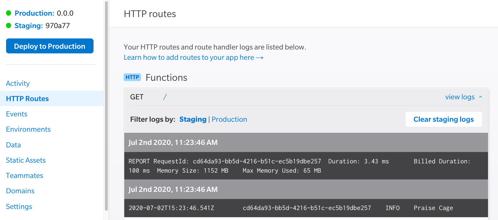

# Serverless API Example with Begin and Architect

## Foundations
The following examples are completely based on [Free Code Camp's APIs and Micro-services Certification: Basic Node and Express](https://www.freecodecamp.org/learn/apis-and-microservices/basic-node-and-express/). 
The original challenge has twelve sections to pass. Unfortunately their test methods are not 100% compatible with a serverless backend because it is relying on a background process to test against. Serverless functions remain stateless and do not retain any memory between invocations. This means that the FCC test server can not reliably have the same results as it is written. I have however been able to replicate the entire process with Express inside of a mono-lambda. You can see that code here: [https://github.com/pchinjr/boilerplate-express](https://github.com/pchinjr/boilerplate-express)

In this repo, I will document and recreate the same functionality to build an API, but with discrete architecture to include single use functions, shared middleware, and static hosting on serverless infrastructure with automated testing and deployments through [Begin](https://begin.com) and GitHub.

To start, make sure you have NodeJS installed and a GitHub account. You can click the button below to create and deploy an app to live infrastructure on Begin.

[](https://begin.com/apps/create?template=https://github.com/pchinjr/fcc-apis-microservices-serverless)


## Function logs and the Node console
`console.log('got here')` is probably my most used debugging tool. It's a simple way to walk through your code execution and inspect different logic paths. To view logs in Begin, go to your Begin console and inspect the route you want. Each function is isolated and has it's own execution environment. In our case, it's a Node environment. When your function is invoked with an HTTP method, AWS will bring up your function code, execute it, and wipe out it's memory. Each time that function is called, it behaves as if it is being run for the first time. This is different from a regular Express server that is long living and can retain data between route invocations. We'll talk about how to persist information in a separate repo. If you are eager to skip ahead to sessions and data persistence, check out [https://learn.begin.com](https://learn.begin.com)

Let's add a `console.log()` statement to the `get-index` function. We're also going to use a helper function from `@architect/functions` which makes working with HTTP and Lambda functions more Express-like. The `arc.http.proxy` function takes a config object and a callback function, we have no config to set in this example. This proxy will serve files in `/public` when the root index is requested. Otherwise, it will ignore `public/index.html` and just return the output of the `get-index` function.

```js
// src/http/get-index/index.js
let arc = require('@architect/functions')

exports.handler = arc.http.proxy( {}, console.log('Praise Cage'))
```
Now when you visit your index route you should see the console output: 


## Serverless HTML and static assets

In the FCC Express challenge, they show you how to create a web server by instantiating Express and opening a port for the server to listen on. With serverless functions, you don't need to create that abstraction. HTTP requests are handled by AWS API Gateway, a service that acts like a web server. When users make a request, each route is handled by a specific Lambda function. This gives us the ability to only write logic that pertains to the request and response needed by that route. It also has added security because the control of that function is only allowed by your app on your Begin domain. Architect takes care of IAM roles and service permissions when your code is deployed. 

The combination of code and the underlying infrastructure is called "Infrastructure as Code". We achieve this by writing a manifest called `app.arc`. You get a snapshot of the entire app codebase AND cloud resources in a single file 
So let's take a look at it now. 
```md
# app.arc
# app namespace - this helps organize the backend resources
@app
fcc-apis

# declaration of static assets, defaults to the /public folder
@static
 
# declaration of HTTP routes, each route has it's own function handler organized by folder
@http
get /
# the function handler is found in /src/http/get-index/index.js

# declaration of Begin Data, a DynamoDB client that gives you a persistent data store.
@tables
data
  scopeID *String
  dataID **String
  ttl TTL
```
To start serving HTML and static assets like a style sheet, we can put them into the public folder.